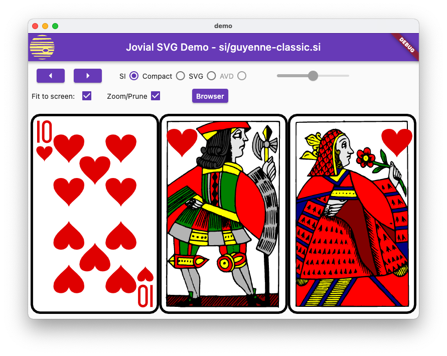

# jovial_svg 

Robust rendering of SVG static images, supporting a well-defined profile
of SVG and an efficient binary storage format.  Very fast load times result
from using this binary format - loading a binary file is usually 5x to 10x
faster than parsing an XML SVG file.  

The supported SVG profile
includes the parts of 
[SVG Tiny 1.2](https://www.w3.org/TR/2008/REC-SVGTiny12-20081222/),
that are applicable to static images, plus commonly-used elements from
[SVG 1.1](https://www.w3.org/TR/2011/REC-SVG11-20110816/).
[Android Vector Drawable](https://developer.android.com/guide/topics/graphics/vector-drawable-resources) files
are also supported.  A widget for displaying scalable images is provided.

To try out the library, see the demo program at
[github](https://github.com/zathras/jovial_svg/tree/main/demo).  It's mostly
intended to be run on the desktop.  It lets you cycle through a series of test
images, including several taken from an open-source card game.

SVG profile notes:

  *  The `stroke-dasharray` and `stroke-dashoffset` attributes are
     supported (cf. Tiny s. 11.4).
  *  Gradients are supported, and additionally support xlink:href attributes to other
     gradients, and gradientTransform attributes from SVG 1.1.
  *  Text elements are supported.
  *  As per the Tiny spec s. 6.2, full CSS is not supported.  However, the
     `style=` attribute is supported as a way of specifying presentation
     attributes.
  *  Non-scaling stroke is not supported (not in SVG 1.1; cf. Tiny 11.5)
  *  Constrained transformations are not supported (not in SVG 1.1;
     cf. Tiny 7.7)
  *  A DOM and features related to animation are not supported.
  *  Conditional processing (Tiny s. 5.8) is not supported
  *  Text restrictions:
      * Embedded fonts are not supported.  However, the font-family attribute
        is recognized, and fonts can be included in an application using this
        library.
      * `textArea` is not supported (not in SVG 1.1).
      * `font-variant` (`small-caps`) is not supported
      * `rotate` is not supported (but normal transformations, including rotation apply).
      * Bi-directional text is not supported
